# Graph recomendation

Backend to analyze Spotify playlists and build a **song similarity graph**, combining:

- Spotify OAuth (Spotipy)
- Deezer enrichment (rank/BPM/gain/genres)
- **Concurrency** (asyncio + aiohttp)
- **Caching** in PostgreSQL (songs/albums/genres)
- **Streaming** responses (NDJSON) to show progress by batches

---

## Quickstart

1) Start PostgreSQL and create the tables (see [db/schema.sql](db/schema.sql)).
2) Create `app/.env` (see template in Configuration).
3) Install dependencies and run:

```bash
python -m venv .venv
# Windows
.\.venv\Scripts\activate

pip install -r requirements.txt
python run.py
```

4) Check it’s alive:

```bash
curl http://127.0.0.1:8000/
```

---

## Current status (branches)

- `main`: full **ingestion + cache + graph** pipeline. Embeddings are **not integrated** here.
- `feature/embedding-genres`: work-in-progress branch implementing **genre embeddings**.

---

## What does it do?

1) User logs in with Spotify.
2) Backend lists playlists; the user selects one.
3) For that playlist:
   - Fetches tracks from Spotify.
   - Queries PostgreSQL to reuse cached data.
   - For uncached tracks, it queries Deezer concurrently:
     - search (`/search`) to map Spotify → Deezer IDs
     - track (`/track/{id}`) for `rank`, `bpm`, `gain`
     - album (`/album/{id}`) for genres (when not cached)
   - Persists results in PostgreSQL (songs, albums, genres).
4) Builds a graph (adjacency matrix) where edge weights come from a feature-based heuristic:
   - album type, track count, release date, artists
   - explicit flag, Spotify popularity, Deezer rank
   - BPM and gain
   - shared genres
5) Streams results in NDJSON so the frontend can consume progress incrementally.

---

## API (FastAPI)

- `GET /` health check
- `GET /login` starts OAuth (or confirms you are already logged in)
- `GET /callback` OAuth callback, stores session and redirects to the frontend
- `GET /playlists` lists user playlists
- `POST /logout` clears session
- `GET /analizePlaylist?id=<playlist_id>` analysis stream in NDJSON

### `/analizePlaylist` response (NDJSON)

The response is a stream of JSON lines (one JSON object per line).

Currently, for **testing and debugging**, the payload includes a `datos` object with enriched per-track metadata (Spotify/Deezer/album/genres). This will be simplified to expose only:

- `songs` (tracks processed in the batch)
- `matrix` (graph / adjacency matrix)
- `batch_index` (progress)

Example of the current batch payload:

```json
{
  "songs": ["Track A", "Track B"],
  "datos": {"<spotify_id>": {"name": "...", "album": {"genres": [...]}, ...}},
  "matrix": [[0, 10, 0], [10, 0, 2], [0, 2, 0]],
  "batch_index": 0
}
```

At the end:

```json
{"done": true}
```

---

## Frontend

Reference frontend:

- https://github.com/saulish/Graph-Recomendation-Frontend

---

## Requirements

- Python 3.10+ (recommended 3.11)
- PostgreSQL 13+
- Spotify Developer credentials (Client ID/Secret)

---

## Configuration (environment variables)

This project uses `app/.env` (gitignored). Create it with:

- `SPOTIFY_API_KEY`
- `SPOTIFY_API_SECRET`
- `FRONT_PORT`
- `BACK_PORT`
- `POSTGRES_HOST`
- `POSTGRES_PORT`
- `POSTGRES_DB`
- `POSTGRES_USER`
- `POSTGRES_PASSWORD`

Optional / `feature/embedding-genres` branch:

- `GENRES_EMBEDDINGS_PATH`
- `GENRES_EMBEDDINGS_VERSION`

Suggested template for `app/.env`:

```dotenv
SPOTIFY_API_KEY=<your_spotify_client_id>
SPOTIFY_API_SECRET=<your_spotify_client_secret>

FRONT_PORT=5500
BACK_PORT=8000

POSTGRES_HOST=127.0.0.1
POSTGRES_PORT=5432
POSTGRES_DB=graph_recomendation
POSTGRES_USER=<user>
POSTGRES_PASSWORD=<password>

# Only feature/embedding-genres (probably temporary)
GENRES_EMBEDDINGS_PATH=<path_to_embeddings>
GENRES_EMBEDDINGS_VERSION=<version>
```

---

## Installation

Install dependencies with `requirements.txt`:

```bash
python -m venv .venv
# Windows
.\.venv\Scripts\activate

pip install -r requirements.txt
```

---

## Database

The schema is based on the provided dump (`gr_schema.sql`). For convenience, a portable version exists at [db/schema.sql](db/schema.sql).

Main tables:

- `albums`
- `songs_data`
- `genres`
- `artists` (present in the schema; not used now, probably deleted)

Notes:

- `albums.genres_id` is stored as JSONB (array of genre IDs).
- The backend reconstructs `{id,name}` genre objects using joins/aggregations.

---

## Run (dev)

Primary way to run is `run.py` (it already starts Uvicorn):

```bash
python run.py
```

By default, the callback redirects to `http://127.0.0.1:<FRONT_PORT>/menu.html`.

CORS:
- Allowed origin is `http://127.0.0.1:<FRONT_PORT>`.

---

## Architecture (overview)


## Notes (real-world behavior)

- Spotify: non-processable items may appear (podcasts/episodes, removed tracks, incomplete metadata). They are filtered/skipped when needed.
- Deezer: some searches return no results or incomplete payloads; tracks are skipped to keep the pipeline moving.
- Performance: processing runs in **batches** (default 20 tracks) with controlled concurrency to maximize throughput without saturating the API.

### Cache strategy (what matters)

- Caches **full songs** (`songs_data`) and **albums** (`albums`) to avoid redundant API calls.
- Detects repeated albums inside the playlist to avoid fetching/saving the same album multiple times.
- Stores genres in `genres` and links them via `albums.genres_id` (JSONB) for quick reconstruction.

---

## Roadmap

- Integrate genre embeddings (`feature/embedding-genres`)
- Store embeddings in Postgres with `pgvector`
- Track embeddings (beyond BPM/gain)
- Embedding songs
- Cursor-based pagination
- Docker + CI/CD

---

## Troubleshooting

- `invalid token`: check cookies/session and ensure the frontend origin matches CORS settings.
- DB errors: confirm tables exist and `app/.env` points to the correct database.
- Deezer empty results: search depends on the query string (`"track + artists"`); some tracks may not map.

---

# Graph recomendation (Español)

Backend para analizar playlists de Spotify y construir un **grafo de similitud entre canciones** combinando:

- OAuth con Spotify (Spotipy)
- Enriquecimiento con Deezer (rank/BPM/gain/géneros)
- **Concurrencia** (asyncio + aiohttp)
- **Caching** en PostgreSQL (canciones/álbumes/géneros)
- Respuesta **streaming** (NDJSON) para ver progreso por lotes

---

## Quickstart

1) Levanta PostgreSQL y crea las tablas (ver [db/schema.sql](db/schema.sql)).
2) Crea `app/.env` (ver plantilla en la sección Configuración).
3) Instala dependencias y ejecuta:

```bash
python -m venv .venv
# Windows
.\.venv\Scripts\activate

pip install -r requirements.txt
python run.py
```

4) Verifica que está vivo:

```bash
curl http://127.0.0.1:8000/
```

## Estado actual (branches)

- `main`: pipeline completo de **ingesta + caché + grafo**. El sistema de embeddings **no está integrado aquí**.
- `feature/embedding-genres`: rama en progreso donde se está implementando **embeddings de géneros**. 

---

## ¿Qué hace el backend?

1) El usuario hace login con Spotify.
2) El backend lista playlists y permite seleccionar una.
3) Para esa playlist:
   - Trae tracks desde Spotify.
   - Consulta PostgreSQL para reutilizar datos ya cacheados.
   - Para lo no cacheado, consulta Deezer concurrentemente:
     - búsqueda (`/search`) para mapear a IDs de Deezer
     - track (`/track/{id}`) para `rank`, `bpm`, `gain`
     - álbum (`/album/{id}`) para géneros (si no estaban cacheados)
   - Guarda en PostgreSQL (canciones, álbumes, géneros).
4) Construye un grafo (matriz de adyacencia) donde el peso entre canciones se calcula con una heurística basada en:
   - tipo de álbum, número de tracks, año/fecha, artistas
   - explicit, popularidad Spotify, ranking Deezer
   - BPM y gain
   - géneros compartidos
5) Devuelve la salida en **streaming NDJSON** por lotes para que el frontend consuma incrementalmente.

---

## API (FastAPI)

- `GET /` health check
- `GET /login` inicia OAuth (o indica si ya estás logueado)
- `GET /callback` callback OAuth, guarda sesión y redirige al frontend
- `GET /playlists` lista playlists del usuario
- `POST /logout` cierra sesión
- `GET /analizePlaylist?id=<playlist_id>` stream de análisis en NDJSON

### Respuesta de `/analizePlaylist` (NDJSON)

La respuesta es una secuencia de líneas JSON (una por línea).

Actualmente, para **pruebas y depuración**, el payload incluye un objeto `datos` con metadata enriquecida por canción (Spotify/Deezer/álbum/géneros). Esta estructura **se simplificará** para exponer solo:

- `songs` (canciones procesadas en el lote)
- `matrix` (grafo / matriz de adyacencia)
- `batch_index` (progreso)

Ejemplo conceptual del payload actual por lote:

```json
{
  "songs": ["Track A", "Track B"],
  "datos": {"<spotify_id>": {"name": "...", "album": {"genres": [...]}, ...}},
  "matrix": [[0, 10, 0], [10, 0, 2], [0, 2, 0]],
  "batch_index": 0
}
```
Al final se emite:

```json
{"done": true}
```

---

## Frontend

Este backend está pensado para consumirse desde un frontend web. Puedes encontrarlo aqui:

- https://github.com/saulish/Graph-Recomendation-Frontend

---

## Requisitos

- Python 3.10+ (recomendado 3.11)
- PostgreSQL 13+
- Credenciales de Spotify Developer (Client ID/Secret)

---

## Configuración (variables de entorno)

Este proyecto usa un archivo `app/.env` (ignorado por git). Crea uno con estas variables:

- `SPOTIFY_API_KEY`
- `SPOTIFY_API_SECRET`
- `FRONT_PORT`
- `BACK_PORT`
- `POSTGRES_HOST`
- `POSTGRES_PORT`
- `POSTGRES_DB`
- `POSTGRES_USER`
- `POSTGRES_PASSWORD`

Opcional / rama `feature/embedding-genres`:

- `GENRES_EMBEDDINGS_PATH`
- `GENRES_EMBEDDINGS_VERSION`

Plantilla sugerida para `app/.env`:

```dotenv
SPOTIFY_API_KEY=<tu_spotify_client_id>
SPOTIFY_API_SECRET=<tu_spotify_client_secret>

FRONT_PORT=5500
BACK_PORT=8000

POSTGRES_HOST=127.0.0.1
POSTGRES_PORT=5432
POSTGRES_DB=graph_recomendation
POSTGRES_USER=<usuario>
POSTGRES_PASSWORD=<password>

# Solo rama feature/embedding-genres, problemente temporal
GENRES_EMBEDDINGS_PATH=<ruta_a_embeddings>
GENRES_EMBEDDINGS_VERSION=<version>
```

---

## Instalación

Instala dependencias con `requirements.txt`:

```bash
python -m venv .venv
# Windows
.\.venv\Scripts\activate

pip install -r requirements.txt
```

---

## Base de datos (schema mínimo esperado)

El schema está basado en el dump adjunto `gr_schema.sql`. Para conveniencia, hay una versión portable en [db/schema.sql](db/schema.sql).

Tablas principales:

- `albums`
- `songs_data`
- `genres`
- `artists` (presente en el schema; actualmente no es requerida por el flujo principal del backend)

Schema (resumen):

```sql
CREATE TABLE IF NOT EXISTS public.albums (
  album_id text PRIMARY KEY,
  name text NOT NULL,
  bpm double precision NOT NULL,
  gain double precision NOT NULL,
  release_date date NOT NULL,
  artists jsonb NOT NULL,
  album_type integer NOT NULL,
  number_songs integer NOT NULL,
  genres_id jsonb NOT NULL
);

CREATE TABLE IF NOT EXISTS public.genres (
  deezer_id integer PRIMARY KEY,
  genre text NOT NULL
);

CREATE TABLE IF NOT EXISTS public.artists (
  deezer_id integer PRIMARY KEY,
  name text NOT NULL
);

CREATE TABLE IF NOT EXISTS public.songs_data (
  deezer_id text NOT NULL,
  name text NOT NULL,
  rank integer NOT NULL,
  popularity integer NOT NULL,
  duration double precision NOT NULL,
  explicit boolean NOT NULL,
  album_id text NOT NULL,
  artists_id jsonb NOT NULL,
  spotify_id text PRIMARY KEY
);
```

Notas:
- `genres_id` se usa como JSONB que contiene un array de IDs de género (enteros).
- El código hace joins y agregaciones para reconstruir `{id,name}` de géneros por álbum.

---

## Ejecutar (dev)

La forma principal de ejecutar el backend es con `run.py` (ya invoca Uvicorn):

```bash
python run.py
```

Por defecto, el callback redirige a `http://127.0.0.1:<FRONT_PORT>/menu.html`.

CORS:
- Se permite el origen `http://127.0.0.1:<FRONT_PORT>`.

---

## Arquitectura (resumen)




## Notas de diseño (por qué así)

- **Concurrencia controlada**: acelera llamadas a Deezer.
- **Caché en PostgreSQL**: reduce llamadas repetidas y hace el sistema más “data-driven”.
- **Streaming NDJSON**: permite UI/cliente progresivo y evita esperar al final de toda la playlist.
- **Grafo con pesos**: representa relaciones entre canciones para recomendación o exploración (vecinos cercanos, clustering, etc.).

---

## Notas y comportamiento en casos reales

- Spotify: pueden aparecer items no procesables (p. ej. podcasts/episodes, tracks eliminados, metadata incompleta). Se filtran/descartan cuando aplica.
- Deezer: algunas búsquedas no devuelven resultados o devuelven payload incompleto; esas canciones se ignoran para no bloquear el pipeline.
- Performance: el análisis se hace por **batches** (por defecto 20 canciones) y con concurrencia controlada para aprovechar al máximo la API sin saturarla.

### Estrategia de caché (lo importante)

- Se cachean **canciones completas** (`songs_data`) y **álbumes** (`albums`) para evitar llamadas redundantes.
- Si varias canciones pertenecen al mismo álbum, se detecta el duplicado y se evita pedir/guardar el álbum más de una vez.
- Los géneros se guardan en `genres` y se enlazan desde `albums.genres_id` (JSONB) para reconstrucción rápida.

---

## Roadmap cercano

- Integrar embeddings de géneros (en `feature/embedding-genres`)
- Persistir embeddings en Postgres con `pgvector`
- Embeddings de canciones (más allá de BPM/gain)
- Paginación cursor-based
- Docker + CI/CD

---

## Troubleshooting rápido

- `invalid token` en endpoints: revisa cookies/sesión y que el frontend esté en el origen permitido por CORS.
- Errores de DB: verifica que el schema existe y que las credenciales en `app/.env` apuntan a la misma DB.
- Deezer devuelve resultados vacíos: el search depende del texto `"track + artists"`; algunas canciones pueden no mapear.

