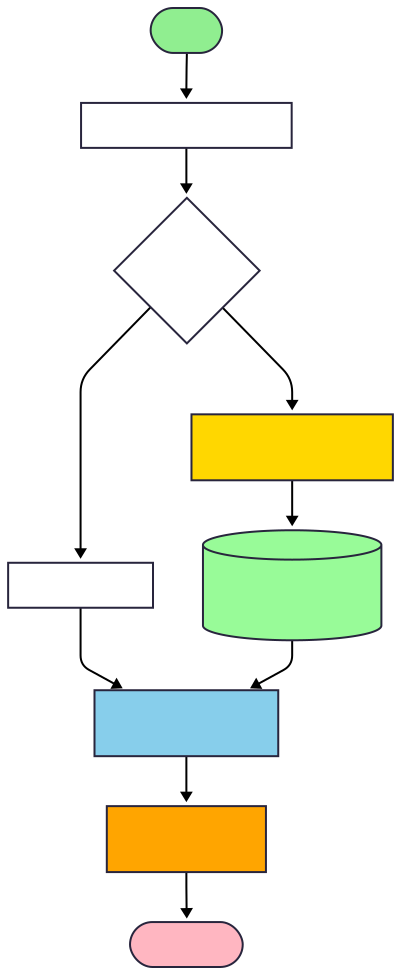
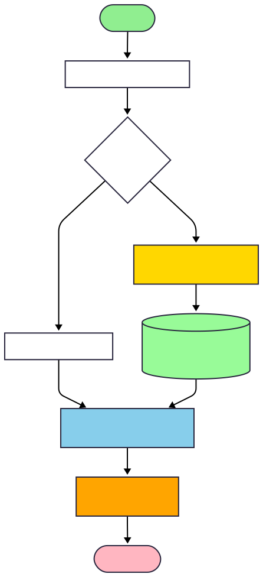

# Graph recomendation

Backend to analyze Spotify playlists and build a **song similarity graph**, combining:

- Spotify OAuth (Spotipy)
- Deezer enrichment (rank/BPM/gain/genres)
- **Concurrency** (asyncio + aiohttp)
- **Caching** in PostgreSQL (songs/albums/genres)
- **Streaming** responses (NDJSON) to show progress by batches

---

## Quickstart

1) Start PostgreSQL and create the tables (see [db/schema.sql](db/schema.sql)).
2) Create `app/.env` (see template in Configuration).
3) Install dependencies and run:

```bash
python -m venv .venv
# Windows
.\.venv\Scripts\activate

pip install -r requirements.txt
python run.py
```

4) Check it’s alive:

```bash
curl http://127.0.0.1:8000/
```

---

## Current status (branches)

- `main`: full **ingestion + cache + graph + genre embeddings** pipeline. Uses **pgvector** (PostgreSQL extension) for embedding storage and cosine similarity.
- `feature/embedding-songs`: **song embeddings** (128-dimensional vectors). PyTorch-trained autoencoder combining audio features + genre embeddings. Includes **UMAP** dimensionality reduction (128D → 2D) for frontend visualization.
- `refactor/producer-consumer-pipeline`: **Producer-consumer architecture** with `asyncio.Queue`. **Parallel** processing of API calls and DB queries. Significant performance improvement (~2-3x faster).

---

## What does it do?

1) User logs in with Spotify.
2) Backend lists playlists; the user selects one.
3) For that playlist:
   - Fetches tracks from Spotify.
   - Queries PostgreSQL to reuse cached data.
   - For uncached tracks, it queries Deezer concurrently:
     - search (`/search`) to map Spotify → Deezer IDs
     - track (`/track/{id}`) for `rank`, `bpm`, `gain`
     - album (`/album/{id}`) for genres (when not cached)
   - Persists results in PostgreSQL (songs, albums, genres).
4) Generates **128-dimensional song embeddings** using a PyTorch autoencoder that combines:
   - Audio features: BPM, gain, duration, popularity, explicit, rank
   - Album features: type, track count, release year
   - **Weighted genre embeddings** (128D from album)
5) Reduces dimensionality with **UMAP** (128D → 2D) for interactive frontend visualization.
6) Streams results in **NDJSON** by batches with 2D coordinates (x, y) for each song enabling progressive rendering.

---

## API (FastAPI)

- `GET /` health check
- `GET /login` starts OAuth (or confirms you are already logged in)
- `GET /callback` OAuth callback, stores session and redirects to the frontend
- `GET /playlists` lists user playlists
- `POST /logout` clears session
- `GET /analizePlaylist?id=<playlist_id>` analysis stream in NDJSON

### `/analizePlaylist` response (NDJSON)

The response is a stream of JSON lines (one JSON object per line). Each batch contains an array of songs with their 2D coordinates for visualization:

```json
[
  {
    "id": "<spotify_id>",
    "x": 0.245,
    "y": -0.832,
    "song_name": "Track A",
    "artists": ["Artist 1", "Artist 2"],
    "album_name": "Album Name"
  },
  {
    "id": "<spotify_id>",
    "x": 1.123,
    "y": 0.456,
    "song_name": "Track B",
    "artists": ["Artist 3"],
    "album_name": "Another Album"
  }
]
```

**Notes on coordinates (x, y):**
- Generated via **UMAP** (128D → 2D reduction) every 3 batches or in the final batch
- Represent semantic similarity: nearby songs are more similar
- `null` when not yet calculated in that specific batch

At the end:

```json
{"done": true}
```

---

## Frontend

Reference frontend:

- https://github.com/saulish/Graph-Recomendation-Frontend

---

## Requirements

- Python 3.10+ (recommended 3.11)
- PostgreSQL 13+
- Spotify Developer credentials (Client ID/Secret)

---

## Configuration (environment variables)

This project uses `app/.env` (gitignored). Create it with:

- `SPOTIFY_API_KEY`
- `SPOTIFY_API_SECRET`
- `FRONT_PORT`
- `BACK_PORT`
- `POSTGRES_HOST`
- `POSTGRES_PORT`
- `POSTGRES_DB`
- `POSTGRES_USER`
- `POSTGRES_PASSWORD`

Suggested template for `app/.env`:

```dotenv
SPOTIFY_API_KEY=<your_spotify_client_id>
SPOTIFY_API_SECRET=<your_spotify_client_secret>

FRONT_PORT=5500
BACK_PORT=8000

POSTGRES_HOST=127.0.0.1
POSTGRES_PORT=5432
POSTGRES_DB=graph_recomendation
POSTGRES_USER=<user>
POSTGRES_PASSWORD=<password>

```

### Performance configuration (config.py)

The system has configurable constants for batch processing and UMAP optimization:

```python
BATCH_SIZE = 20               # Songs processed per batch (API calls)
MIN_UMAP_SIZE = 3             # Execute UMAP every N batches
MIN_UMAP_BATCH_SIZE = 60      # Minimum accumulated songs to trigger UMAP
```

**Tuning recommendations:**
- **Increase `BATCH_SIZE`** (e.g., 30-50) for faster processing with more concurrent API calls might affect the deezer petitions
- **Decrease `MIN_UMAP_SIZE`** (e.g., 2) for more frequent 2D updates in frontend (higher CPU usage)
- **`MIN_UMAP_BATCH_SIZE`** should typically be `BATCH_SIZE * MIN_UMAP_SIZE`

---

## Installation

Install dependencies with `requirements.txt`:

```bash
python -m venv .venv
# Windows
.\.venv\Scripts\activate

pip install -r requirements.txt
```

---

## Database

The schema is based on the provided dump (`gr_schema.sql`). For convenience, a portable version exists at [db/schema.sql](db/schema.sql).

Main tables:

- `albums` — album metadata (BPM, gain, release date, etc.)
- `songs_data` — cached Spotify tracks with Deezer enrichment + **128D embeddings** and model version
- `genres` — genre catalog with **128-dimensional embeddings** (via pgvector)
- `album_genres` — **many-to-many** relationship (album ↔ genres) for optimized joins
- `artists` (present in the schema; not actively used yet)

Notes:

- `albums.genres_id` is stored as JSONB (array of genre IDs) for backward compatibility.
- **`album_genres` table** (many-to-many) is now used for efficient joins with `genres` (including embeddings).
- **pgvector extension** is installed in PostgreSQL. Both `genres` and `songs_data` tables have `vector(128)` columns for embeddings.
- **Embeddings cache**: `songs_data.embedding` stores pre-computed vectors to avoid regeneration in subsequent analyses.
- `embedding_ver` tracks model version to invalidate cache when the model is updated.

---

## Run (dev)

Primary way to run is `run.py` (it already starts Uvicorn):

```bash
python run.py
```

By default, the callback redirects to `http://127.0.0.1:<FRONT_PORT>/menu.html`.

CORS:
- Allowed origin is `http://127.0.0.1:<FRONT_PORT>`.

---

## Architecture (overview)



---

## Genre embeddings & pgvector

The system uses **128-dimensional genre embeddings** to compute semantic similarity between albums based on their musical genres. This enables the recommendation engine to understand genre relationships beyond simple exact matches.

**Key implementation details:**

1. **Vector storage**: The `genres` table includes an `embedding` column of type `vector(128)` using PostgreSQL's **pgvector extension**.

2. **Many-to-many relationships**: The `album_genres` table links albums to multiple genres (an album can have several genres, a genre can belong to many albums).

3. **Cosine similarity in SQL**: The function `consult_cosine_similarity(album_id_1, album_id_2)` computes the **average embedding vector** for all genres of each album, then calculates cosine similarity using pgvector's `<=>` operator:
   ```sql
   SELECT 1 - (avg_emb_1 <=> avg_emb_2) AS cosine_similarity
   ```

4. **Graph weights**: In `graph.py`, the `compareSongs()` function calls `consult_cosine_similarity()` and adds the result to edge weights:
   ```python
   embeddings_diff = conn.consult_cosine_similarity(album_id_1, album_id_2)
   w += int((embeddings_diff + 0.5) * w)
   ```

5. **Benefits**: This approach allows the system to understand that "jazz" and "blues" are semantically closer than "jazz" and "death metal", improving recommendation quality by leveraging pre-trained genre embeddings.

**pgvector setup:**
- Requires PostgreSQL 16+ with the pgvector extension compiled for your platform (Windows builds available).
- See `db/schema.sql` for the complete schema including indexes optimized for vector operations.

---

## Song embeddings (autoencoder + UMAP)

The system generates **128-dimensional embeddings per song** using a PyTorch-trained neural autoencoder, combining audio features with genre embeddings to capture multidimensional similarity.

**Model architecture:**

- **Input**: 137 dimensions
  - 9 numeric features: rank, popularity, duration, BPM, gain, album_type, number_songs, explicit, release_year
  - 128 dimensions from genre embeddings (weighted average × 2.0 for songs with genres)
  
- **Encoder**: 4 dense layers with LeakyReLU, BatchNorm, Dropout
  - 137 → 256 → 256 → **128 (final embedding)**
  
- **Decoder**: symmetric for reconstruction (64 → 128 → 256 → 256 → 137)

**Preprocessing:**
- StandardScaler for numeric feature normalization
- Imputation for missing values (especially BPM)
- Differential weighting for songs without genres (embedding × 0.1 vs × 2.0)

**Dimensionality reduction with UMAP:**
```python
reducer = umap.UMAP(
    n_components=2,
    n_neighbors=15,
    min_dist=0.1,
    metric="cosine",
    random_state=42
)
embeddings_2D = reducer.fit_transform(embeddings_128D)
```

**Performance optimization:**
- 2D embeddings are generated every 3 batches (MIN_UMAP_SIZE) or in the final batch
- Avoids recalculating UMAP on every batch, reducing latency
- Buffer accumulates 128D embeddings for aggregate transformation

**PostgreSQL cache:**
- Column `songs_data.embedding` (128D vector) stores pre-computed embeddings
- `embedding_ver` invalidates cache when model is updated
- Cached songs generate 2D embeddings immediately in the first batch

**Benefits:**
- Interactive 2D visualization where distance represents semantic similarity
- Captures non-linear relationships between audio features and genres
- Persistent cache accelerates subsequent analyses of the same playlist

**UMAP edge cases:**
```python
# Handling edge cases
if n == 0: return np.empty((0, 2))
if n == 1: return np.array([[0.0, 0.0]])
if n == 2: return np.array([[-1.0, 0.0], [1.0, 0.0]])
```
- UMAP requires n ≥ 3 to work correctly
- Cases with 0, 1, or 2 songs return predefined coordinates
- Avoids errors and guarantees consistent response

---

## Producer-consumer architecture (asyncio)

The system implements a **producer-consumer pattern** using `asyncio.Queue` to maximize throughput and parallel processing.

**Processing flow:**

```
┌─────────────────┐         ┌──────────────┐
│ cache_producer  │────────▶│              │
│  (DB queries)   │         │ asyncio.Queue│◀───┐
└─────────────────┘         │              │    │
                            └──────┬───────┘    │
┌─────────────────┐                │            │
│  api_producer   │────────────────┘            │
│ (Spotify/Deezer)│                             │
└─────────────────┘                             │
                                                │
                            ┌──────────────┐    │
                            │ consumer_main│────┘
                            │  (Frontend)  │
                            └──────────────┘
```

**Components:**

1. **`cache_producer`** (Producer 1):
   - Queries PostgreSQL for cached songs
   - Generates 2D embeddings with UMAP
   - Puts payload in queue
   - Executes **only once** at startup

2. **`api_producer`** (Producer 2):
   - Processes uncached songs in batches (default: 20)
   - Calls Spotify/Deezer APIs concurrently
   - Generates 128D embeddings and reduces to 2D every N batches
   - Puts payloads in queue progressively

3. **`consumer_main`** (Consumer):
   - Reads from queue with timeout (0.5s)
   - Yields to frontend via StreamingResponse
   - Monitors status of both producers
   - Terminates when both producers finish

**Performance advantages:**

- **True parallelism**: DB and API run simultaneously (not sequentially)
- **Reduced latency**: Frontend receives first batch ~2-3x faster
- **Maximized throughput**: Leverages API I/O time while processing cache
- **Automatic backpressure**: Queue buffer prevents memory overload

**Configuration (config.py):**
```python
BATCH_SIZE = 20              # Songs per API batch
MIN_UMAP_SIZE = 3            # Execute UMAP every N batches
MIN_UMAP_BATCH_SIZE = 60     # Minimum songs to execute UMAP
```

**Synchronization:**
```python
while producers > 0:
    batch = await asyncio.wait_for(queue.get(), timeout=0.5)
    yield (json.dumps(batch) + "\n").encode("utf-8")
    
    if cache_task and cache_task.done():
        producers -= 1
    if api_task and api_task.done():
        producers -= 1
```

**UMAP optimization:**
- Uses `asyncio.to_thread()` to execute UMAP without blocking event loop
- Reduces to 2D every `MIN_UMAP_SIZE` batches or at the end
- Additional condition: executes if `songs_without_2d >= MIN_UMAP_BATCH_SIZE`

---

## Notes (real-world behavior)

- Spotify: non-processable items may appear (podcasts/episodes, removed tracks, incomplete metadata). They are filtered/skipped when needed.
- Deezer: some searches return no results or incomplete payloads; tracks are skipped to keep the pipeline moving.
- Performance: processing runs in **batches** (default 20 tracks) with controlled concurrency to maximize throughput without saturating the API.

### Cache strategy (what matters)

- Caches **full songs** (`songs_data`) and **albums** (`albums`) to avoid redundant API calls.
- Detects repeated albums inside the playlist to avoid fetching/saving the same album multiple times.
- Stores genres in `genres` and links them via `albums.genres_id` (JSONB) for quick reconstruction.

---

## Roadmap

### ✅ Completed
- ✅ Integrate genre embeddings (128-dimensional vectors)
- ✅ Store embeddings in Postgres with `pgvector`
- ✅ **Song embeddings** (PyTorch autoencoder with 128D)
- ✅ **Dimensionality reduction with UMAP** (128D → 2D) for visualization
- ✅ **Embeddings cache** in PostgreSQL with model versioning
- ✅ **Producer-consumer architecture** with `asyncio.Queue` for parallel processing

### 🔨 In Progress / Planned

**Phase 1: Code Quality & Architecture**
- Endpoint refactoring (RESTful conventions, better error handling, validation)
- Structured logging system (structured JSON logs, log levels, request tracing)
- Testing suite (unit tests, integration tests, API endpoint tests)

**Phase 2: Scalability & Performance**
- Redis for user sessions/tokens (PostgreSQL handles embeddings efficiently ~100ms for 100+ embeddings)
- Multi-user concurrency optimization (connection pooling, request queuing, rate limiting)

**Phase 3: Core Features**
- **Song recommendation system** (cosine similarity on embeddings via pgvector, personalized recommendations, collaborative filtering)
- Recommendation API endpoints (similar songs, playlist generation, discover mode)

**Phase 4: Infrastructure**
- Docker containerization (multi-stage builds, docker-compose for dev/prod)
- CI/CD pipeline (automated testing, deployment workflows, health checks)

---

## Troubleshooting

- `invalid token`: check cookies/session and ensure the frontend origin matches CORS settings.
- DB errors: confirm tables exist and `app/.env` points to the correct database.
- Deezer empty results: search depends on the query string (`"track + artists"`); some tracks may not map.

---

# Graph recomendation (Español)

Backend para analizar playlists de Spotify y construir un **grafo de similitud entre canciones** combinando:

- OAuth con Spotify (Spotipy)
- Enriquecimiento con Deezer (rank/BPM/gain/géneros)
- **Concurrencia** (asyncio + aiohttp)
- **Caching** en PostgreSQL (canciones/álbumes/géneros)
- Respuesta **streaming** (NDJSON) para ver progreso por lotes

---

## Quickstart

1) Levanta PostgreSQL y crea las tablas (ver [db/schema.sql](db/schema.sql)).
2) Crea `app/.env` (ver plantilla en la sección Configuración).
3) Instala dependencias y ejecuta:

```bash
python -m venv .venv
# Windows
.\.venv\Scripts\activate

pip install -r requirements.txt
python run.py
```

4) Verifica que está vivo:

```bash
curl http://127.0.0.1:8000/
```

---

## Estado actual (branches)

- `main`: pipeline completo de **ingesta + caché + grafo + embeddings de géneros**. Usa **pgvector** (extensión de PostgreSQL) para almacenar embeddings y calcular similitud por coseno.
- `feature/embedding-songs`: **embeddings de canciones** (vectores de 128 dimensiones). Autoencoder entrenado con PyTorch que combina features de audio + embeddings de géneros. Incluye reducción dimensional con **UMAP** (128D → 2D) para visualización en frontend.
- `refactor/producer-consumer-pipeline`: **Arquitectura productor-consumidor** con `asyncio.Queue`. Procesamiento **paralelo** de API calls y consultas a DB. Mejora significativa de rendimiento (~2-3x más rápido). 

---

## ¿Qué hace el backend?

1) El usuario hace login con Spotify.
2) El backend lista playlists y permite seleccionar una.
3) Para esa playlist:
   - Trae tracks desde Spotify.
   - Consulta PostgreSQL para reutilizar datos ya cacheados.
   - Para lo no cacheado, consulta Deezer concurrentemente:
     - búsqueda (`/search`) para mapear a IDs de Deezer
     - track (`/track/{id}`) para `rank`, `bpm`, `gain`
     - álbum (`/album/{id}`) para géneros (si no estaban cacheados)
   - Guarda en PostgreSQL (canciones, álbumes, géneros).
4) Genera **embeddings de canciones de 128 dimensiones** usando un autoencoder PyTorch que combina:
   - Features de audio: BPM, gain, duración, popularidad, explicit, rank
   - Features de álbum: tipo, número de tracks, año de lanzamiento
   - **Embeddings ponderados de géneros** (128D del álbum)
5) Reduce dimensionalidad con **UMAP** (128D → 2D) para visualización interactiva en el frontend.
6) Devuelve la salida en **streaming NDJSON** por lotes con coordenadas 2D (x, y) de cada canción para renderizado progresivo.

---

## API (FastAPI)

- `GET /` health check
- `GET /login` inicia OAuth (o indica si ya estás logueado)
- `GET /callback` callback OAuth, guarda sesión y redirige al frontend
- `GET /playlists` lista playlists del usuario
- `POST /logout` cierra sesión
- `GET /analizePlaylist?id=<playlist_id>` stream de análisis en NDJSON

### Respuesta de `/analizePlaylist` (NDJSON)

La respuesta es una secuencia de líneas JSON (una por línea). Cada lote contiene un array de canciones con sus coordenadas 2D para visualización:

```json
[
  {
    "id": "<spotify_id>",
    "x": 0.245,
    "y": -0.832,
    "song_name": "Track A",
    "artists": ["Artist 1", "Artist 2"],
    "album_name": "Album Name"
  },
  {
    "id": "<spotify_id>",
    "x": 1.123,
    "y": 0.456,
    "song_name": "Track B",
    "artists": ["Artist 3"],
    "album_name": "Another Album"
  }
]
```

**Notas sobre las coordenadas (x, y):**
- Generadas mediante **UMAP** (reducción de 128D → 2D) cada 3 batches o en el último lote
- Representan similitud semántica: canciones cercanas son más similares
- `null` cuando no se han calculado en ese batch específico

Al final se emite:

```json
{"done": true}
```

---

## Frontend

Este backend está pensado para consumirse desde un frontend web. Puedes encontrarlo aqui:

- https://github.com/saulish/Graph-Recomendation-Frontend

---

## Requisitos

- Python 3.10+ (recomendado 3.11)
- PostgreSQL 13+
- Credenciales de Spotify Developer (Client ID/Secret)

---

## Configuración (variables de entorno)

Este proyecto usa un archivo `app/.env` (ignorado por git). Crea uno con estas variables:

- `SPOTIFY_API_KEY`
- `SPOTIFY_API_SECRET`
- `FRONT_PORT`
- `BACK_PORT`
- `POSTGRES_HOST`
- `POSTGRES_PORT`
- `POSTGRES_DB`
- `POSTGRES_USER`
- `POSTGRES_PASSWORD`

Plantilla sugerida para `app/.env`:

```dotenv
SPOTIFY_API_KEY=<tu_spotify_client_id>
SPOTIFY_API_SECRET=<tu_spotify_client_secret>

FRONT_PORT=5500
BACK_PORT=8000

POSTGRES_HOST=127.0.0.1
POSTGRES_PORT=5432
POSTGRES_DB=graph_recomendation
POSTGRES_USER=<usuario>
POSTGRES_PASSWORD=<password>

```

### Configuración de rendimiento (config.py)

El sistema tiene constantes configurables para procesamiento por lotes y optimización de UMAP:

```python
BATCH_SIZE = 20               # Canciones procesadas por lote (llamadas API)
MIN_UMAP_SIZE = 3             # Ejecutar UMAP cada N lotes
MIN_UMAP_BATCH_SIZE = 60      # Mínimo de canciones acumuladas para ejecutar UMAP
```

**Recomendaciones de ajuste:**
- **Aumentar `BATCH_SIZE`** (ej., 30-50) para procesamiento más rápido con más llamadas API concurrentes (requiere más memoria)
- **Disminuir `MIN_UMAP_SIZE`** (ej., 2) para actualizaciones 2D más frecuentes en el frontend (mayor uso de CPU)
- **`MIN_UMAP_BATCH_SIZE`** típicamente debe ser `BATCH_SIZE * MIN_UMAP_SIZE`

---

## Instalación

Instala dependencias con `requirements.txt`:

```bash
python -m venv .venv
# Windows
.\.venv\Scripts\activate

pip install -r requirements.txt
```

---

## Base de datos

El schema está basado en el dump adjunto `gr_schema.sql`. Para conveniencia, hay una versión portable en [db/schema.sql](db/schema.sql).

Tablas principales:

- `albums` — metadata de álbumes (BPM, gain, fecha de lanzamiento, etc.)
- `songs_data` — tracks de Spotify cacheados con enriquecimiento de Deezer + **embeddings de 128D** y versión del modelo
- `genres` — catálogo de géneros con **embeddings de 128 dimensiones** (vía pgvector)
- `album_genres` — relación **muchos-a-muchos** (álbum ↔ géneros) para joins optimizados
- `artists` (presente en el schema; no se usa activamente aún)

Notas:

- `albums.genres_id` se almacena como JSONB (array de IDs de género) para compatibilidad hacia atrás.
- **Tabla `album_genres`** (muchos-a-muchos) se usa ahora para joins eficientes con `genres` (incluidos embeddings).
- **Extensión pgvector** está instalada en PostgreSQL. Las tablas `genres` y `songs_data` tienen columnas `vector(128)` para embeddings.
- **Cache de embeddings**: `songs_data.embedding` almacena vectores pre-calculados para evitar regeneración en subsecuentes análisis.
- `embedding_ver` rastrea la versión del modelo para invalidar cache cuando el modelo se actualiza.

---

## Ejecutar (dev)

La forma principal de ejecutar el backend es con `run.py` (ya invoca Uvicorn):

```bash
python run.py
```

Por defecto, el callback redirige a `http://127.0.0.1:<FRONT_PORT>/menu.html`.

CORS:
- Se permite el origen `http://127.0.0.1:<FRONT_PORT>`.

---

## Arquitectura (resumen)



---

## Embeddings de géneros y pgvector

El sistema utiliza **embeddings de géneros de 128 dimensiones** para calcular la similitud semántica entre álbumes basándose en sus géneros musicales. Esto permite al motor de recomendación entender relaciones entre géneros más allá de simples coincidencias exactas.

**Detalles clave de implementación:**

1. **Almacenamiento vectorial**: La tabla `genres` incluye una columna `embedding` de tipo `vector(128)` utilizando la **extensión pgvector de PostgreSQL**.

2. **Relaciones muchos-a-muchos**: La tabla `album_genres` vincula álbumes con múltiples géneros (un álbum puede tener varios géneros, un género puede pertenecer a muchos álbumes).

3. **Similitud coseno en SQL**: La función `consult_cosine_similarity(album_id_1, album_id_2)` calcula el **vector de embedding promedio** de todos los géneros de cada álbum, luego calcula la similitud coseno usando el operador `<=>` de pgvector:
   ```sql
   SELECT 1 - (avg_emb_1 <=> avg_emb_2) AS cosine_similarity
   ```

4. **Pesos del grafo**: En `graph.py`, la función `compareSongs()` llama a `consult_cosine_similarity()` y añade el resultado a los pesos de las aristas:
   ```python
   embeddings_diff = conn.consult_cosine_similarity(album_id_1, album_id_2)
   w += int((embeddings_diff + 0.5) * w)
   ```

5. **Beneficios**: Este enfoque permite al sistema entender que "jazz" y "blues" están semánticamente más cerca que "jazz" y "death metal", mejorando la calidad de las recomendaciones al aprovechar embeddings de géneros pre-entrenados.

**Configuración de pgvector:**
- Requiere PostgreSQL 16+ con la extensión pgvector compilada para tu plataforma (hay builds disponibles para Windows).
- Ver `db/schema.sql` para el schema completo incluyendo índices optimizados para operaciones vectoriales.

---

## Embeddings de canciones (autoencoder + UMAP)

El sistema genera **embeddings de 128 dimensiones por canción** usando un autoencoder neuronal entrenado con PyTorch, combinando features de audio con embeddings de géneros para capturar similitud multidimensional.

**Arquitectura del modelo:**

- **Input**: 137 dimensiones
  - 9 features numéricas: rank, popularity, duration, BPM, gain, album_type, number_songs, explicit, release_year
  - 128 dimensiones de embeddings de géneros (promedio ponderado × 2.0 para canciones con géneros)
  
- **Encoder**: 4 capas densas con LeakyReLU, BatchNorm, Dropout
  - 137 → 256 → 256 → 128 → **64 (embedding final)**
  
- **Decoder**: simétrico para reconstrucción (64 → 128 → 256 → 256 → 137)

**Preprocesamiento:**
- StandardScaler para normalización de features numéricas
- Imputación de valores faltantes (especialmente BPM)
- Peso diferencial para canciones sin géneros (embedding × 0.1 vs × 2.0)

**Reducción dimensional con UMAP:**
```python
reducer = umap.UMAP(
    n_components=2,
    n_neighbors=15,
    min_dist=0.1,
    metric="cosine",
    random_state=42
)
embeddings_2D = reducer.fit_transform(embeddings_128D)
```

**Optimización de rendimiento:**
- Los embeddings 2D se generan cada 3 batches (MIN_UMAP_SIZE) o en el último lote
- Evita recalcular UMAP en cada batch, reduciendo latencia
- Buffer acumula embeddings 128D para transformación agregada

**Cache en PostgreSQL:**
- Columna `songs_data.embedding` (vector 128D) almacena embeddings pre-calculados
- `embedding_ver` invalida cache cuando el modelo se actualiza
- Canciones cacheadas generan embeddings 2D inmediatamente en el primer batch

**Beneficios:**
- Visualización interactiva en 2D donde la distancia representa similitud semántica
- Captura relaciones no lineales entre features de audio y géneros
- Cache persistente acelera análisis subsecuentes de la misma playlist

**Casos especiales en reducción UMAP:**
```python
# Manejo de edge cases
if n == 0: return np.empty((0, 2))
if n == 1: return np.array([[0.0, 0.0]])
if n == 2: return np.array([[-1.0, 0.0], [1.0, 0.0]])
```
- UMAP requiere n ≥ 3 para funcionar correctamente
- Casos con 0, 1 o 2 canciones retornan coordenadas predefinidas
- Evita errores y garantiza respuesta consistente

---

## Arquitectura productor-consumidor (asyncio)

El sistema implementa un **patrón productor-consumidor** usando `asyncio.Queue` para maximizar throughput y procesamiento paralelo.

**Flujo de procesamiento:**

```
┌─────────────────┐         ┌──────────────┐
│ cache_producer  │────────▶│              │
│  (DB queries)   │         │ asyncio.Queue│◀───┐
└─────────────────┘         │              │    │
                            └──────┬───────┘    │
┌─────────────────┐                │            │
│  api_producer   │────────────────┘            │
│ (Spotify/Deezer)│                             │
└─────────────────┘                             │
                                                │
                            ┌──────────────┐    │
                            │ consumer_main│────┘
                            │  (Frontend)  │
                            └──────────────┘
```

**Componentes:**

1. **`cache_producer`** (Productor 1):
   - Consulta PostgreSQL para canciones cacheadas
   - Genera embeddings 2D con UMAP
   - Pone payload en la queue
   - Ejecuta **una sola vez** al inicio

2. **`api_producer`** (Productor 2):
   - Procesa canciones no cacheadas en batches (default: 20)
   - Llama APIs de Spotify/Deezer concurrentemente
   - Genera embeddings 128D y reduce a 2D cada N batches
   - Pone payloads en la queue progresivamente

3. **`consumer_main`** (Consumidor):
   - Lee de la queue con timeout (0.5s)
   - Hace `yield` al frontend vía StreamingResponse
   - Monitorea estado de ambos productores
   - Termina cuando ambos productores finalizan

**Ventajas de rendimiento:**

- **Paralelismo real**: DB y API se ejecutan simultáneamente (no secuencialmente)
- **Latencia reducida**: Frontend recibe primer batch ~2-3x más rápido
- **Throughput maximizado**: Aprovecha tiempo de I/O de APIs mientras procesa cache
- **Backpressure automático**: Queue buffer previene sobrecarga de memoria

**Configuración (config.py):**
```python
BATCH_SIZE = 20              # Canciones por batch de API
MIN_UMAP_SIZE = 3            # Cada cuántos batches ejecutar UMAP
MIN_UMAP_BATCH_SIZE = 60     # Mínimo de canciones para ejecutar UMAP
```

**Sincronización:**
```python
while producers > 0:
    batch = await asyncio.wait_for(queue.get(), timeout=0.5)
    yield (json.dumps(batch) + "\n").encode("utf-8")
    
    if cache_task and cache_task.done():
        producers -= 1
    if api_task and api_task.done():
        producers -= 1
```

**Optimización UMAP:**
- Usa `asyncio.to_thread()` para ejecutar UMAP sin bloquear event loop
- Reduce a 2D cada `MIN_UMAP_SIZE` batches o al final
- Condición adicional: ejecuta si `songs_without_2d >= MIN_UMAP_BATCH_SIZE`

---

## Notas de diseño (por qué así)

- **Arquitectura productor-consumidor**: Dos productores independientes (`cache_producer` y `api_producer`) alimentan una `asyncio.Queue`. El consumidor (`consumer_main`) procesa batches concurrentemente y los envía al frontend.
- **Concurrencia real**: Las consultas a DB y las llamadas a API (Spotify/Deezer) se ejecutan **en paralelo**, maximizando throughput.
- **Streaming NDJSON**: permite UI/cliente progresivo; el frontend recibe datos inmediatamente sin esperar el procesamiento completo.
- **Buffer de embeddings**: acumula embeddings 128D para transformaciones UMAP agregadas, reduciendo overhead computacional.

---

## Notas y comportamiento en casos reales

- Spotify: pueden aparecer items no procesables (p. ej. podcasts/episodes, tracks eliminados, metadata incompleta). Se filtran/descartan cuando aplica.
- Deezer: algunas búsquedas no devuelven resultados o devuelven payload incompleto; esas canciones se ignoran para no bloquear el pipeline.
- Performance: el análisis se hace por **batches** (por defecto 20 canciones) y con concurrencia controlada para aprovechar al máximo la API sin saturarla.

### Estrategia de caché (lo importante)

- Se cachean **canciones completas** (`songs_data`) y **álbumes** (`albums`) para evitar llamadas redundantes.
- Si varias canciones pertenecen al mismo álbum, se detecta el duplicado y se evita pedir/guardar el álbum más de una vez.
- Los géneros se guardan en `genres` y se enlazan desde `albums.genres_id` (JSONB) para reconstrucción rápida.

---

## Roadmap

### ✅ Completado
- ✅ Integrar embeddings de géneros (vectores de 128 dimensiones)
- ✅ Persistir embeddings en Postgres con `pgvector`
- ✅ **Embeddings de canciones** (autoencoder PyTorch con 128D)
- ✅ **Reducción dimensional con UMAP** (128D → 2D) para visualización
- ✅ **Cache de embeddings** en PostgreSQL con versionado de modelo
- ✅ **Arquitectura productor-consumidor** con `asyncio.Queue` para procesamiento paralelo

### 🔨 En Progreso / Planeado

**Fase 1: Calidad de Código & Arquitectura**
- Refactorización de endpoints (convenciones RESTful, mejor manejo de errores, validación)
- Sistema de logging estructurado (logs JSON estructurados, niveles de log, trazabilidad de requests)
- Suite de testing (pruebas unitarias, pruebas de integración, pruebas de endpoints)

**Fase 2: Escalabilidad & Rendimiento**
- Redis para sesiones/tokens de usuario (PostgreSQL maneja embeddings eficientemente ~100ms para 100+ embeddings)
- Optimización de concurrencia multi-usuario (connection pooling, queue de requests, rate limiting)

**Fase 3: Features Core**
- **Sistema de recomendación de canciones** (similitud coseno sobre embeddings vía pgvector, recomendaciones personalizadas, filtrado colaborativo)
- Endpoints de API de recomendación (canciones similares, generación de playlists, modo descubrimiento)

**Fase 4: Infraestructura**
- Containerización con Docker (multi-stage builds, docker-compose para dev/prod)
- Pipeline CI/CD (testing automatizado, workflows de deployment, health checks)

---

## Troubleshooting

- `invalid token` en endpoints: revisa cookies/sesión y que el frontend esté en el origen permitido por CORS.
- Errores de DB: verifica que el schema existe y que las credenciales en `app/.env` apuntan a la misma DB.
- Deezer devuelve resultados vacíos: el search depende del texto `"track + artists"`; algunas canciones pueden no mapear.

